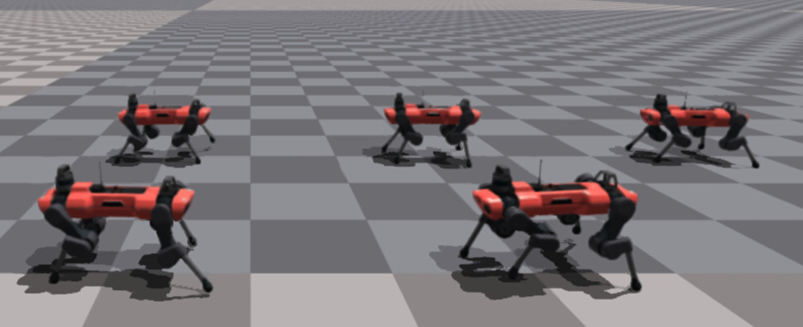

<!--p align="center"></p-->

Hello there, and welcome to my website! My name is Samuel Schmidgall and I'm a researcher and engineer focused on applying AI to the field of medicine and medical robotics.

I am currently a **1st year PhD student @ Johns Hopkins University** in Electrical and Computer Engineering. I'm jointly advised by Rama Chellappa and Axel Krieger in the [Artificial Intelligence for Engineering and Medicine Lab (AIEM)](https://aiem.jhu.edu/) and the [Intelligent Medical Robotic Systems and Equipment Lab (IMERSE)](https://imerse.lcsr.jhu.edu/) toward building autonomous surgical robots and medical language models. I'm very grateful to have received support from the [NSF Graduate Research fellowship](https://www.nsfgrfp.org/).

I'm currently doing an internship (April - July) at [Stanford University School of Medicine](https://med.stanford.edu/). If you're in the bay area and want to talk about anything research related let me know!

Outside of research, I like to travel, play tennis, write, and most of all spend time with my wonderful wife ❤️

## Awards

- National Science Foundation Graduate Research Fellowship (NSF GRFP), ~$147,000 September 2023-May 2026
- 2022 Alan Berman Research Publication Award for work "SpikePropamine: Differentiable Plasticity in Spiking Neural Networks"
- Best Poster Award MEGL Symposium Poster Presentation Spring 2020
– Outstanding Poster Award Joint Mathematics Meeting Conference Spring 2019

## Software

AgentClinic: a multimodal agent benchmark to evaluate AI in simulated clinical environments: https://github.com/samuelschmidgall/agentclinic

## Publications

### Journal

- **Schmidgall, S.**, Kim, JW., Krieger, A. (2024). Can robots imitate surgeon demonstrations? Nature Reviews Urology.

- **Schmidgall, S.**, Ziaei, R., Jascha, A., Louis, K., Hajiseyedrazi, T., Eshraghian, J., (2024). Brain-inspired learning in artificial neural networks. Applied Physics Letters Machine Learning.

- **Schmidgall, S.**, Hays, J. (2023). 
Meta-SpikePropamine: Learning to learn with synaptic plasticity in spiking neural networks. Frontiers in Neuroscience.

- Holzer, M., Richey, Z., Rush, W., **Schmidgall, S.**, (2022). 
Locked fronts in a discrete time discrete space population model. Journal of Mathematical Biology.

- **Schmidgall, S.**, Ashkanazy, J., Lawson, W., Hays, J, (2021). 
SpikePropamine: Differentiable Plasticity in Spiking Neural Networks. Frontiers in Neurorobotics

### Conference

- **Schmidgall, S.**, Krieger, A., Eshraghian, J. (2024). Surgical Gym: A high-performance GPU-based platform for reinforcement learning with surgical robots. International Conference on Robotics and Automation (ICRA 2024).

- Ziaei, R., **Schmidgall, S.**, Language models are susceptible to incorrect patient self-diagnosis in clinical applications (2023). Conference on Neural Information Processing Systems (NeurIPS 2023), Workshop on Deep Generative Models for Health.

- Kim, JW., **Schmidgall, S.**, Krieger, A., Kobilarov, M., (2023). Learning a Library of Surgical Manipulation Skills for Robotic Surgery. Conference on Robotic Learning (CoRL 2023), CRL WS Workshop

- **Schmidgall, S.**, Hays, J., (2023). SMA: A three-factor learning rule for synaptic motor adaptation in spiking neural networks. International Conference on Neuromorphic Systems (ICONS).

- **Schmidgall, S.**, Parsa, M., Schuman, C. (2023). Biological connectomes as a representation for the architecture of artificial neural networks. Proceedings of the 2023 AAAI Conference on Artificial Intelligence "Systems Neuroscience Approach to General Intelligence" Workshop.

- **Schmidgall, S.**, Hays, J., (2022). Stable Lifelong Learning: Spiking neurons as a solution to instability in plastic neural networks. Neuro-Inspired Computational Elements (NICE). 

- Lukyanenko, A., Camphire, H., Austin, A., **Schmidgall, S.**, Soudbakhsh, D., (2021). Optimal Localized Trajectory Planning of Multiple Non-holonomic Vehicles. 5th Conference on Control Technology and Applications (CCTA).

- **Schmidgall, S.** (2021). Self-constructing Neural Networks through Random Mutation. International Conference on Learning Representations (ICLR).

- **Schmidgall, S.**, (2020). Adaptive Reinforcement Learning through Evolving Self-Modifying Neural Networks. The 2020 Genetic and Evolutionary Computation Conference (GECCO).

### Textbook

- Opferman, J., **Schmidgall, S.**, Krieger, A., (2024). State-of-the-Art and Future of Autonomous Robotic Surgery. AI & Urology

